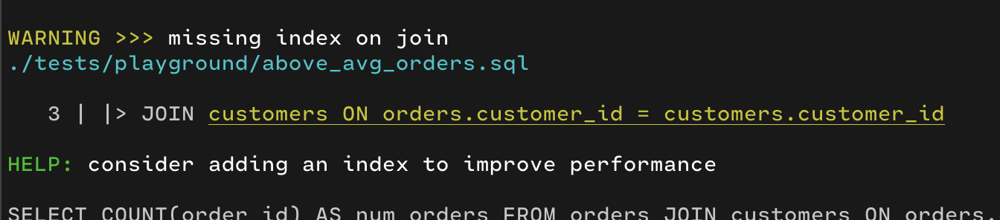

<samp>

This compiler simplifies complex SQL with pipe syntax, enabling step-by-step query building that auto-generates native SQL. It includes a checker for readability, performance tips, and diagnostics to catch errors, making SQL writing and maintenance effortless.


Example:

with pipe syntax:

```sql
FROM orders
|> JOIN customers ON orders.customer_id = customers.customer_id
|> WHERE orders.total_amount > (SELECT AVG(total_amount) FROM orders)
|> AGGREGATE COUNT(order_id) AS num_orders
GROUP BY customers.customer_name;
```

to native SQL:

```sql
SELECT COUNT(orders.order_id) AS num_orders
FROM orders
JOIN customers ON orders.customer_id = customers.customer_id
WHERE orders.total_amount > (SELECT AVG(total_amount) FROM orders)
GROUP BY customers.customer_name;
```

with pipe syntax:

```sql
FROM employees
|> JOIN departments ON employees.dept_id = departments.id
|> WHERE employees.salary > 50000
|> ORDER BY employees.salary DESC
LIMIT 5;
```

to native SQL:

```sql
SELECT *
FROM employees
JOIN departments ON employees.dept_id = departments.id
WHERE employees.salary > 50000
ORDER BY employees.salary DESC
LIMIT 5;

```


[paper](https://research.google/pubs/sql-has-problems-we-can-fix-them-pipe-syntax-in-sql/)

checker diagnostics:


